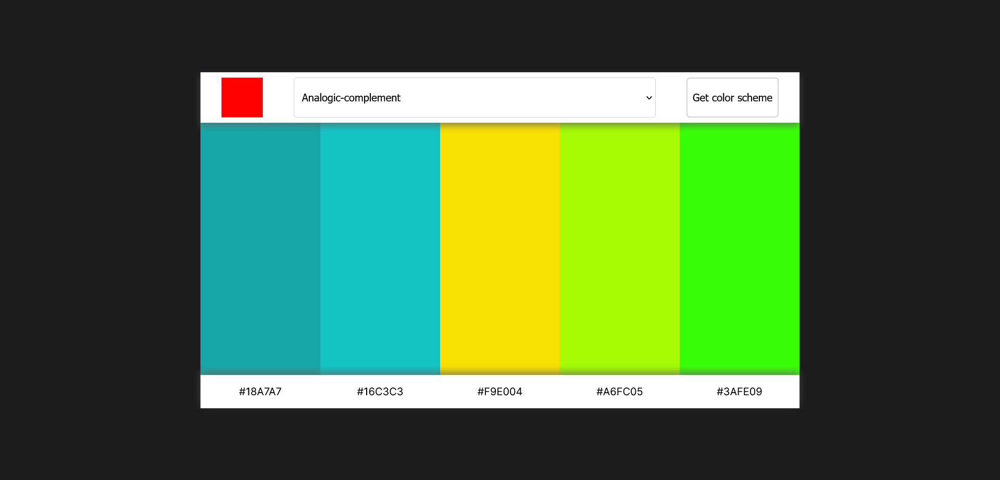
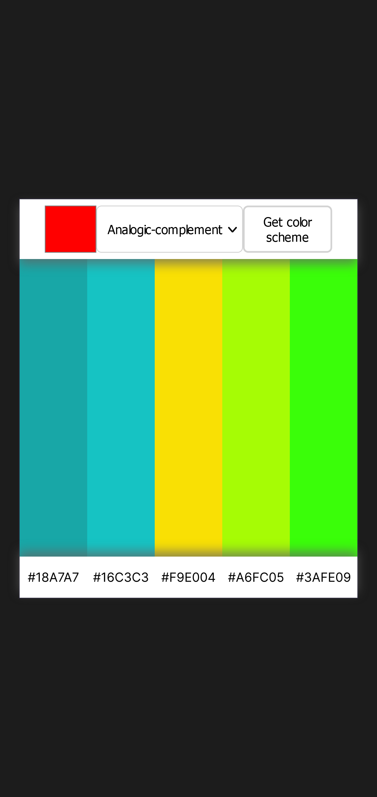

# Color Picker -An API UI to choose color themes

This is a solution to the Solo Project provided by Scrimba. The design was provided by the platform, the solution is however entirely my own. This was an exercise to solidify my REST API basics as well as some CSS concepts.  
Live at: https://saragadalmawla.github.io/colorPicker/

## Table of contents

- [Overview](#overview)
  - [The challenge](#the-challenge)
  - [Screenshot](#screenshot)
- [My process](#my-process)
  - [Built with](#built-with)
  - [Continued development](#continued-development)

## Overview

### The challenge

Users should be able to:

- Choose a color and a theme
- Click "get color scheme" to get 5 colors according to the theme selected  
from the drop down menu
- Copy the hex colors by clicking on them

### Screenshots

#### Desktop

#### Mobile

## My process

### Built with

- Semantic HTML5 markup
- CSS custom properties
- Flexbox
- The color API

### Continued development
- Add user options (no of colors wanted for example)
- Add a light mode
- Enhance responsiveness

